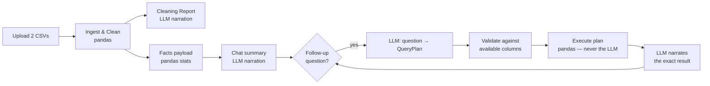

<div align="center">

# ☕ Starbucks Nutrition Intelligence

**LLM-powered nutrition analysis over the Starbucks drinks and food menus.**
pandas computes every number. The LLM only narrates values it's handed — never asked to do arithmetic.

[](https://www.python.org/)
[](https://streamlit.io/)
[](https://console.groq.com/)
[](tests/)

</div>

---

## What it does

Upload two CSVs — a drinks menu and a food menu — and get:

1. **A cleaning report** showing exactly how dirty the data was and what got fixed.
2. **An LLM-written EDA summary**: a stats table plus a natural-language walkthrough of what stands out.
3. **A chat** you can ask follow-up questions in plain English, including filters ("food items under 500 calories").
4. **Stats and charts** — descriptive statistics, ratios, drinks-vs-food comparisons, and visualizations.

Nothing renders until both CSVs are in — the app asks for the data first.

## Architecture



The LLM never touches a DataFrame directly. It either narrates a JSON facts
payload pandas already computed, or proposes a `QueryPlan` (a small,
validated JSON shape) that pandas then executes. No `eval`, no `exec`, no
model-supplied column names reaching pandas unchecked.

## Quick start

```bash
python -m venv .venv
source .venv/bin/activate    # Windows: .venv\Scripts\activate
pip install -r requirements.txt
```

A Groq key is optional. Without one, ingestion, cleaning, statistics, and
charts all work; generated summaries and chat answers show a plain
availability notice instead. To enable them, get a free key at
[console.groq.com](https://console.groq.com/keys):

```bash
cp .env.example .env         # Windows: copy .env.example .env
# then paste your key into .env: GROQ_API_KEY=gsk_...
```

```bash
streamlit run app.py        # web interface — open the printed localhost URL
python main.py --report     # CLI: data quality report (bundled sample CSVs)
python main.py --summary    # CLI: generated nutritional summary
pytest -q                   # tests
```

## Using the web app

Drop both CSVs into the single uploader — the app guesses which file is
drinks vs food from the filename, and asks you to confirm if that's
ambiguous. Unrecognised column headers get a mapping prompt instead of
being silently guessed.

Right after upload, a **data cleaning report** shows how dirty each file
was and exactly what got cleaned out (duplicates, missing values,
unparseable cells, absent columns).

| Tab | What's in it |
|---|---|
| **Chat** | Opens with an LLM-written EDA summary (stats table + narration). Ask follow-up questions in plain English, including filtering — every answer is computed by pandas first, then narrated by the LLM. |
| **Data & Stats** | Full data table, descriptive statistics, derived ratios (fat-to-protein, per-100-kcal macros), and a drinks-vs-food comparison (raw and normalised). |
| **Charts** | Top items by nutrient, and a macro-composition comparison between drinks and food. |

Unanswerable questions (missing data, subjective) are declined with a
reason, not a made-up figure.

## Project layout

```
app.py                  Streamlit UI — the only place tabs/widgets live
main.py                 CLI: --report / --summary against the bundled CSVs
src/
├── config.py            Canonical schema, aliases, LLM settings
├── ingestion/            CSV in → clean DataFrame + audit report out
│   ├── loader.py          Encoding-resilient file reading
│   ├── resolver.py        Header mapping for arbitrary uploads
│   ├── cleaner.py         Coercion, dedup, the audit trail
│   └── pipeline.py        Orchestration + capability registry
├── analytics/            pandas-only: stats, ratios, comparisons, filters
├── llm/                  Every LLM touchpoint, nothing else
│   ├── client.py           Groq wrapper: cache, error containment, no-key fallback
│   ├── prompts.py          Versioned prompt templates
│   ├── facts.py            DataFrame → compact JSON facts payload
│   ├── summarizer.py       facts → prose (EDA + cleaning report)
│   ├── planner.py          question → validated QueryPlan
│   ├── executor.py         plan → pandas result → narration
│   └── schemas.py          Pydantic shapes for the query plan
└── viz/                  Plotly figure builders, no Streamlit import
```

## Specifications

| Doc | Covers |
|---|---|
| [`docs/SPEC.md`](docs/SPEC.md) | The original brief, verbatim, plus a requirement-to-code traceability table and the current system design |
| [`docs/DATA_NOTES.md`](docs/DATA_NOTES.md) | Audit findings for the supplied CSVs |
| [`docs/PRESENTATION_CONTENT.md`](docs/PRESENTATION_CONTENT.md) | Slide-by-slide content for the submission deck |

## Status

- [x] Ingestion layer with encoding fallback, sentinel handling, dedup, audit trail
- [x] Column resolver (uploads with unknown headers)
- [x] Capability registry
- [x] Analytics layer (descriptive stats, null-safe ratios, comparison, predicate filters)
- [x] Charts (top-N bar, macro composition)
- [x] LLM summarisation (facts payload, Groq client, cache, error containment)
- [x] NL query planner (plan → validate → execute → narrate, one retry)
- [x] Data cleaning report, narrated from the real ingestion report
- [x] Streamlit UI (upload gate, chat, data & stats, charts)
- [x] Test suite (74 tests)

## Data notes

See [`docs/DATA_NOTES.md`](docs/DATA_NOTES.md) for what the audit found in
the supplied CSVs, including which nutrients the source data does not carry.
