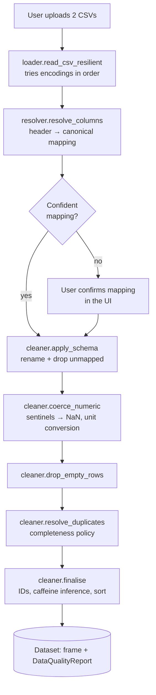
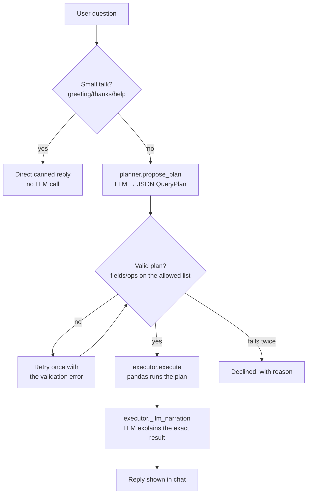

# System Design — Starbucks Nutrition Intelligence

End-to-end technical documentation of the application: how it's approached, how to run
it, the design decisions behind it, and diagrams of how data moves through it. Written
against the codebase as it currently stands (74 passing tests).

## Contents

- [Overview of the approach](#overview-of-the-approach)
- [How to run the application](#how-to-run-the-application)
- [System architecture](#system-architecture)
- [Module-by-module reference](#module-by-module-reference)
- [Key design decisions and trade-offs](#key-design-decisions-and-trade-offs)
- [Screenshots and diagrams](#screenshots-and-diagrams)

---

## Overview of the approach

The app loads two CSVs (a Starbucks drinks menu and a food menu), cleans them, and lets
a user explore the data through a chat interface, a stats view, and charts. The single
design rule that shapes everything else:

> **pandas computes every number. The LLM only narrates numbers it's handed.**

This exists because LLMs are unreliable at arithmetic and prone to inventing plausible-
sounding but wrong figures. Rather than trust an LLM to compute a mean or rank items,
the app computes everything deterministically in pandas first, and the LLM's only job is
turning already-correct numbers into readable prose — or, for chat questions, proposing
*what* to compute (as a small validated plan), never *how* to compute it.

The approach breaks into five stages, each independently testable:

1. **Upload** — the app shows nothing until both CSVs are provided.
2. **Ingest & clean** — encoding detection, header resolution, sentinel-value handling,
   deduplication; every transformation is logged to an audit report.
3. **Report** — the audit report is narrated back to the user before anything else,
   so they know how much to trust the data.
4. **Analyse** — descriptive statistics, ratios, and drinks-vs-food comparisons,
   entirely in pandas.
5. **Explain** — a compact JSON "facts" payload (never raw rows) is handed to Groq for
   narration; the user can then ask follow-up questions in the same chat.

---

## How to run the application

### Setup

```bash
python -m venv .venv
source .venv/bin/activate       # Windows: .venv\Scripts\activate
pip install -r requirements.txt
```

### Configure the LLM (optional)

```bash
cp .env.example .env            # Windows: copy .env.example .env
# paste a free key from https://console.groq.com/keys into .env:
# GROQ_API_KEY=gsk_...
```

Without a key, `LLMClient.enabled` is `False` and `complete()` returns a plain notice
string instead of raising — ingestion, cleaning, statistics, and charts are unaffected;
only the AI-written narration and chat answers fall back to a deterministic, template-
based summary (`src/llm/facts.py::data_briefing`).

### Run

```bash
streamlit run app.py            # web app — open the printed localhost URL
python main.py --report         # CLI: data-quality report on the bundled sample CSVs
python main.py --summary        # CLI: LLM-generated nutritional summary
pytest -q                       # full test suite (74 tests)
```

Once the web app is open, upload both CSVs into the single file uploader (drinks and
food together) — the app infers which is which from the filename, and asks for
clarification only if that's ambiguous.

---

## System architecture

### Module layers

```
app.py                    Streamlit UI only — wires the layers below together
main.py                   CLI entrypoint, same underlying pipeline, no UI

src/config.py              Canonical schema, header aliases, LLM settings, thresholds

src/ingestion/              CSV in → clean DataFrame + audit report out
├── loader.py                 Encoding-resilient file reading
├── resolver.py                Header → canonical column resolution for arbitrary uploads
├── cleaner.py                  Sentinel handling, coercion, dedup, the audit trail
└── pipeline.py                  Orchestration + the capability registry

src/analytics/               pandas-only: no LLM import anywhere in this package
├── stats.py                    describe(), derived_ratios(), top_n(), safe_ratio()
├── compare.py                   raw_comparison(), normalised_comparison()
└── filters.py                    Predicate engine used by the chat's query executor

src/llm/                     Every LLM touchpoint, and nothing else
├── client.py                    Groq wrapper: disk cache, no-key/error containment
├── prompts.py                    Versioned prompt templates
├── facts.py                       DataFrame → compact JSON facts payload
├── summarizer.py                   facts → prose (opening summary + cleaning report)
├── schemas.py                       Pydantic shapes for the query plan
├── planner.py                        question → validated QueryPlan
└── executor.py                        plan → pandas execution → narration

src/viz/
└── charts.py                Plotly figure builders, no Streamlit import
```

Each layer has exactly one reason to change: a new nutrient column touches
`config.py`; a new cleaning rule touches `ingestion/`; a new statistic touches
`analytics/`; a new prompt or LLM behaviour touches `llm/`; a new chart touches `viz/`.
`app.py` never contains business logic — only widget layout and calls into the layers
above.

### Data flow: loading and cleaning



Every stage appends to the same `DataQualityReport`, which is what the "data cleaning
report" on the front end narrates.

### Data flow: answering a chat question



The LLM is on both ends of this flow (proposing the plan, narrating the result) but
never in the middle — `execute()` is pure pandas, and `QueryPlan`/`Predicate` are the
only shapes that ever reach it. There is no `eval`, `exec`, or `getattr` on an
LLM-supplied string anywhere in this path.

---

## Module-by-module reference

### `src/config.py`
Single source of truth for the canonical nutrient schema, human-readable labels, header
aliases (so `"Protein"` and `"Protein (g)"` both resolve to `protein_g`), expected units
and conversion factors, null sentinels (`"-"`, `"N/A"`, ...), the caffeine-inference
keyword lists, the duplicate-resolution policy, and LLM model/temperature/token
settings. Loads `.env` via `python-dotenv` at import time.

### `src/ingestion/loader.py`
`read_csv_resilient()` tries a fixed list of encodings in order (`utf-8-sig` first,
then UTF-16 variants, then Latin-1/cp1252) until one produces a real multi-column
result — this is what makes the UTF-16-with-BOM food CSV load without the caller
needing to know its encoding in advance. Accepts either a filesystem path or a
file-like object (Streamlit's `UploadedFile`), so the same function serves the CLI and
the web upload path.

### `src/ingestion/resolver.py`
Resolves arbitrary uploaded headers to canonical columns without hard-coding raw
header strings, in four confidence tiers (EXACT / FUZZY / SUGGEST / NONE). Uses
substring containment and `difflib.SequenceMatcher` for fuzzy scoring, plus a separate
heuristic (`_pick_item_column`) to find the item-name column when no alias matches —
mostly-text, mostly-unique columns score highest. Anything below the FUZZY threshold is
surfaced to the user rather than guessed silently.

### `src/ingestion/cleaner.py`
The actual cleaning pipeline: `apply_schema` (rename to canonical, drop unmapped),
`coerce_numeric` (sentinel detection and counting, then numeric coercion, then unit
conversion if the resolver found a mismatched unit), `drop_empty_rows` (rows with zero
real nutrition data), `resolve_duplicates` (exact duplicates dropped silently;
same-name-different-values conflicts resolved by a stated policy — default
"completeness", keep whichever row has the most non-null fields, tie-break on higher
calories), and `finalise` (item IDs, caffeine inference for drinks, sort). Every stage
writes to the shared `DataQualityReport` dataclass.

### `src/ingestion/pipeline.py`
Orchestrates the above into `load_source()` / `load_all()`, and defines the
**capability registry** (`capabilities()`): which nutrients are actually present with
real data, per source and in common across both sources. This is what lets the rest of
the app (UI, analytics, LLM prompts) never assume a column exists — it asks the
registry instead, and it's recomputed on every upload so a richer CSV automatically
unlocks more comparisons.

### `src/analytics/stats.py`, `compare.py`, `filters.py`
Pure pandas, no LLM import anywhere. `describe()` produces the mean/median/std/min/max/
coverage table that both the Data & Stats tab and the LLM's opening summary are built
from. `safe_ratio()` guards every division against a zero or null denominator (never
produces `inf`). `raw_comparison()`/`normalised_comparison()` provide the two
drinks-vs-food views — raw and per-100-kcal — since neither alone tells the whole
story (drinks are measured per serving, food per item). `filters.py`'s `Predicate` /
`apply_predicates()` is the one and only filtering mechanism in the app: a closed set
of six comparison operators, validated against the capability registry before touching
the frame. Called by the chat's query executor whenever a question implies a
condition ("food items under 500 calories") — there is no direct UI equivalent.

### `src/llm/client.py`
The only place that talks to Groq. Three guarantees live here and nowhere else: no API
key → `enabled=False` and a plain notice string, never an exception; any SDK/network
error → a short formatted notice, full traceback only in the logs; identical
`(model, system, user, json_mode)` → served from a SHA-256-keyed disk cache
(`.cache/`), so a repeated prompt never re-spends an API call in the same session.

### `src/llm/prompts.py`
Three versioned system prompts: `SUMMARY_SYSTEM_V1` (opening EDA summary — markdown
stats table + prose), `NARRATE_SYSTEM_V1` (turn one executed query result into a
sentence), `QUALITY_SYSTEM_V1` (narrate the cleaning report — markdown table + prose).
Each includes explicit rules against inventing figures and requires attaching the
comparison caveat / labelling inferred fields.

### `src/llm/facts.py`
`build_facts()` turns a dataset dict into the compact JSON payload the opening summary
is generated from — mean/median/std/min/max/coverage per nutrient per source, a few
standout items by calories, the mean fat-to-protein ratio, and both comparison views.
Kept deliberately small and fixed-size regardless of row count, so prompt cost doesn't
scale with the dataset. `data_briefing()` is the non-LLM fallback used when no API key
is configured.

### `src/llm/schemas.py`
Pydantic models: `Filter` (one condition, op restricted to a `Literal` of six
operators), `QueryPlan` (dataset/metric/op/filters/group_by/limit), `PlanError`. This
is the contract between the planner and the executor — nothing reaches `execute()`
that doesn't first pass this shape.

### `src/llm/planner.py`
`propose_plan()` sends the question plus the list of currently-available fields to a
small, fast model in JSON mode, and either returns a validated `QueryPlan` or a
`PlanError`. On a previous failed attempt, the exact validation error is fed back into
the next prompt rather than blindly retrying.

### `src/llm/executor.py`
`execute()` is the only function that actually runs a plan against pandas — field
names are validated against the capability registry first, filters go through the
shared `Predicate` path, and every result is passed through `_to_native()` before
returning (pandas/numpy scalars aren't JSON-serialisable). `answer()` is the top-level
loop: small talk short-circuits before the planner is even called; otherwise plan →
validate → execute → narrate, with one retry on a validation failure, and a
deterministic `narrate_result()` fallback if the LLM is disabled or errors.

### `src/llm/summarizer.py`
Thin glue: `summarise()` and `quality_briefing()` just call `client.complete()` with
the right prompt; `chat_briefing()` adds the one piece of real logic — fall back to
`data_briefing()` if the client is disabled or the LLM call itself failed.

### `src/viz/charts.py`
`top_n_bar()` (horizontal bar of the top N items by a chosen nutrient) and
`macro_composition()` (grouped bar comparing drinks vs food, per 100 kcal). No
Streamlit import — every function takes pandas in, returns a Plotly `Figure` out, so
it can be tested or rendered independently of the running app.

### `app.py`
The upload gate, the data-cleaning report, and the three tabs (Chat, Data & Stats,
Charts) described above. Two `st.cache_data`/`st.cache_resource` functions avoid
re-loading files or re-instantiating the LLM client on every Streamlit rerun; two
content-hash checks (`report_id`, `data_id`) avoid re-asking the LLM for the same
cleaning report or opening summary when nothing has actually changed.

---

## Key design decisions and trade-offs

### Included, and why

| Decision | Why |
|---|---|
| pandas computes, LLM only narrates | LLMs are unreliable at arithmetic; this makes that irrelevant to correctness |
| LLM sees a compact facts payload, never raw rows | Prompt size stays fixed regardless of row count; nothing to leak or over-fit to |
| Every LLM-proposed plan is validated before execution | An invalid field/operator is rejected, never run on trust |
| Disk-cached LLM responses | Repeated prompts (same question, same data) never re-call the API |
| One retry on an invalid plan, with the error fed back | Cheap recovery from a malformed first attempt without silently giving up |
| Filtering expressed as natural language in chat | Covers the brief's filtering requirement without a separate widget layer to build and keep in sync |
| Column resolver with confidence tiers, not hard-coded headers | The app accepts CSVs beyond the two supplied ones without silently mis-mapping a column |
| Data-cleaning report shown before anything else | Trust is earned by disclosure — the user sees exactly what was changed, not just clean-looking output |
| 74 automated tests | Ingestion, analytics, LLM safety boundaries, and the app itself are all covered |

### Deliberately excluded, and why

| Excluded | Why |
|---|---|
| Database / authentication | Unnecessary for a single-user prototype over ~190 rows |
| RAG / vector store | No document corpus exists here — two spreadsheets don't need retrieval |
| General-purpose agent framework | The LLM only ever does one of a few pre-approved things; an explicit narrow design was simpler and more auditable than a general agent loop |
| Imputing missing nutrition values | The app reports a gap rather than inventing a number to fill it |
| Static sidebar filter widgets | Removed in favour of natural-language filtering through chat — same requirement, less UI surface |
| Distribution/scatter charts, multi-select axis pickers | Trimmed to the two chart types the brief actually names (bar/pie-equivalent), avoiding scope creep beyond the stated requirement |

---

## Screenshots and diagrams

Where to capture screenshots for the submission deck (not included in this repo):

1. **Upload gate** — the single combined uploader, before any data is loaded.
2. **Data cleaning report** — right after upload, showing the markdown table + narration.
3. **Chat tab** — the opening EDA summary (stats table + prose) and a follow-up
   question/answer exchange.
4. **Data & Stats tab** — the full table and comparison views.
5. **Charts tab** — the top-N bar chart and the macro-composition comparison.

The two Mermaid diagrams above (loading/cleaning, and question-answering) are the
architecture diagrams referenced by the brief's "diagrams where applicable" — they
render directly on GitHub, and can be re-exported as images for the slide deck.
